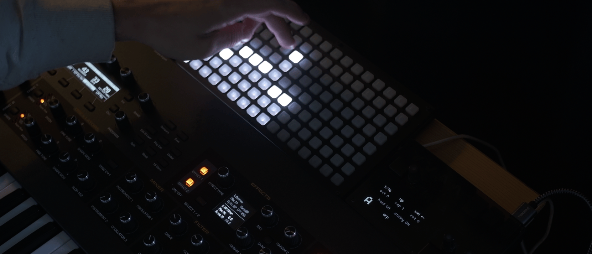

# Arpeggii

Two-layer arpeggiator with up to 16 notes, velocity control, note divisor/modulo and per-layer phrase save/recall.

Play notes and arpeggiate them. Mix and match arps on both layers. If your synth is also your input device, remember to set 'local off'.

Required: norns, grid 64 (untested) or 128, a midi input device, a midi-enabled sound generator

### Arp view (default)

All controls apply to the currently selected layer only.

| | |
|---|---|
| `E1`: arp rate division | `K1`+`E1`: octave |
| `E2`: arp play mode | `K1`+`E2`: repeats |
| `E3`: edit velocity of all steps in current layer | `K1`+`E3`: rotate |
| `K2`: flip layer | `K1`+`K2`: toggle hold |
| `K3`: toggle phrase view | `K1`+`K3`: toggle sticky (new notes pile up) |

- `E1`: arp rate division
- `E2`: arp play mode
- `E3`: edit velocity of all steps in current layer
- `K2`: flip layer
- `K3`: toggle phrase view
- hold `K1`: alt controls, lap view
- `K1`+`E1`: octave
- `K1`+`E2`: repeats
- `K1`+`E3`: rotate
- `K1`+`K2`: toggle hold
- `K1`+`K3`: toggle sticky (new notes pile up)
- tap grid column: velocity
- tap bottom row: toggle between skip/mute step
- long press bottom row: delete note

### Lap view (hold K1)

- tap column: set divisor (1-8). note only plays every x laps
- tap again: mute/skip toggle. choose whether note is skipped or muted on the off laps
- long press: invert toggle. note plays every lap except x
- long press bottom row: insert/replace selected note. waits for next incoming midi note. tap again to toggle between insert/replace
- press anywhere else to abort

### Phrase view (press/hold K3)

Phrases contain a full layer snapshot, including arp settings.
  Snapshots containing no notes are displayed dimmer on the grid.

- left half: layer A
- right half: layer B
- tap to save/recall
- `K1`+tap to delete

### Parameters

- **Midi**: select your i/o devices and channels. each layer can be triggered from a different midi device (currently untested) and can output midi to a different device and/or channel.
- **collision**: determines what happens when two layers play the same note on the same device and channel.
  - *none*: no handling, causes some synths to drop notes
  - *merge*: one note on, only releases when both layers do
  - *skip*: the second note on is ignored
- **autosave**: reloads the last state on boot
- **load last session**: reload the autosave backup on demand
- **velocity fuzz**: randomises velocity by x amount
- **fuzz press/all**: velocity randomised either only on grid tap or every time the note is triggered
- **lap memory on**: the lap divisor settings are retained even when a new arp is played
- **rotation**: allows divisor settings to be rotated without rotating notes
- **k1 priority**: chooses whether insert or replace is triggered first on k1+long press bottom row
- **pending replace**: whether or not a note is silenced while awaiting replacement
- **hold/sticky**: global or per-phrase
- **clear all phrases**: wipes all saved phrases
